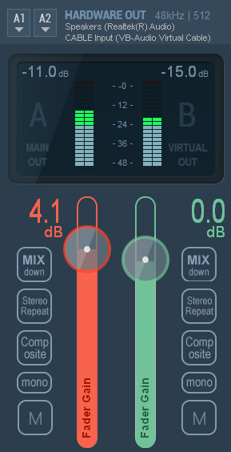
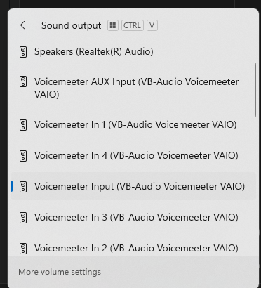

# Teams Audio Copilot

This tool captures audio from a Microsoft Teams meeting and generates suggested replies using OpenAI GPT, live-transcribing what others are saying.

## Features

- 🧠 Real-time transcription using [Vosk](https://alphacephei.com/vosk/)
- 🗣️ Audio routed from Teams using VB-Cable or VoiceMeeter
- 🤖 Live responses using `gpt-4o` from OpenAI API

---

## Setup Instructions

### 1. 🐍 Python Setup

```bash
git clone https://github.com/your-repo/teams-audio-copilot.git
cd teams-audio-copilot
python -m venv .venv
.venv\Scripts\activate   # Windows
pip install -r requirements.txt
```

---

### 2. 🎧 Audio Routing with VoiceMeeter

1. **Install [VoiceMeeter Banana](https://vb-audio.com/Voicemeeter/banana.htm)** – this allows routing of audio from Teams to the script.
2. **Install [VB-Cable](https://vb-audio.com/Cable/)** – a virtual audio device.
3. In **VoiceMeeter**, configure:
   - A1 output: your headphones (AirPods, Realtek, etc.)
   - A2 output: `CABLE Input (VB-Audio Virtual Cable)`
   - B1/B2: optional recording bus
4. In **Windows Sound Settings**:
   - Set default **output** device to `VoiceMeeter Input`
   - In **Teams**, go to Settings > Devices:
     - Speaker: `VoiceMeeter Input`
     - Microphone: your normal mic or `VoiceMeeter Output`



---

### 3. 🧠 Vosk Model Setup

1. Download the Vosk model (recommended: `vosk-model-small-en-us-0.15`) from [here](https://alphacephei.com/vosk/models).
2. Extract it into your project folder as `vosk-model-small-en-us-0.15/`.

---

### 4. 🔐 Environment

Edit your Python script and set your OpenAI key:
```python
client = OpenAI(api_key="your-openai-key-here")
```

---

### 5. ▶️ Run the Assistant

Make sure VoiceMeeter is routing audio and Teams is playing.
Then run:

```bash
python teams-listen-and-answer-copilot.py
```

You should see:

```
🎧 Listening for Teams audio...
🗣 You heard: ...
🤖 GPT: ...
```

---

### Notes

- Set the correct `device_index` from `sounddevice.query_devices()` to match `VB-Cable Output` or `VoiceMeeter B1/B2`.
- Make sure `channels=1` works with your device. Some require `channels=2`.